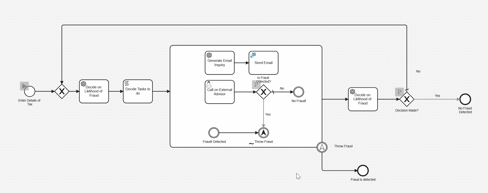

# AI Fraud Detection Example

This is an example used for a tutorial where you can build an AI Agent in BPMN with Camunda to determin fraud. 

## How it works

The process starts when a form is filled in by a user who wants to submit informatoin on their tax return. We then have an OpenAI bot that checks that data for any indication of fraud. The AI will then select from a list of tasks to perform. 

The tasks that can be preformed are located in the Ad-Hoc sub process and are 
1. Send an email asking for more information
1. Ask a human expert for thier opinion
1. Declare that fraud has been detected. 

Each of these options triggers a different type of action. Sending an email activites two service tasks. Asking an expert will activate a front end application and detecting fraud will activate an escelation event that will cancel the process. 

## Instalation Instructions 

### Setup Required

This example requires a little bit of setup. You will need a Camunda 8 account (the easiest place to do that is [Camunda SaaS](https://signup.camunda.com/accounts)). Create a new cluster any version from `8.7.x` onward will work.

 You will also need to create a [SendGrid](https://sendgrid.com/en-us) account and you need to create a [OpenAI](https://openai.com/) Account. Then, you need to get an API key for both services. 

### Setting up Secrets

🔐 It’s important to know that it’s best practice not to simply copy and paste this sensitive information directly into the model but rather to [create a secret](https://docs.camunda.io/docs/components/console/manage-clusters/manage-secrets/) for each of these in your Camunda cluster. Then you can reference it by typing `{{secrets.yourSecretHere}}` followed by the name of the key you want to access.

For this example to work you'll need to create secrets with the following names:

- OpenAI
- SendGrid

### How to Deploy it

Once you have both accounts, it's pretty easy to get started. Upload the BPMN model and the Forms to a Camunda Modeler project in Camunda 8. From the modeler you can run the process in Play or deploy it to a cluster.

If deployed to a cluster you have the option to start the process from the Modeler or from Tasklist.